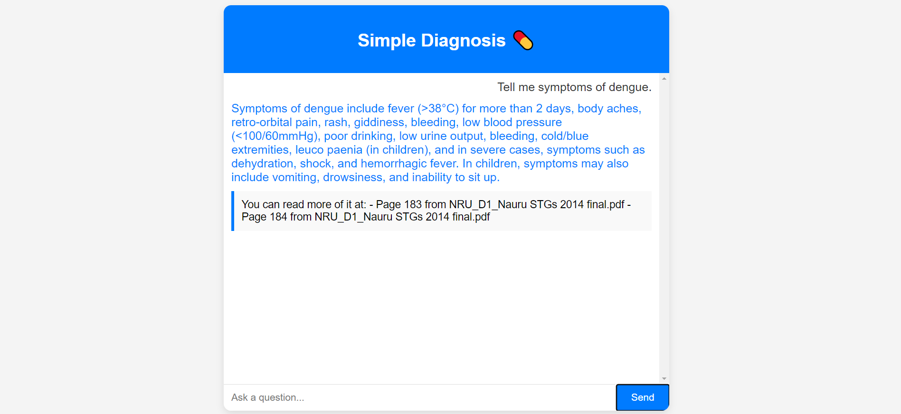

# SimpleDiagnosis Chatbot

## Overview
SimpleDiagnosis is a basic chatbot system that leverages the Pinecone API, LlamaIndex, and Hugging Face models to create an interactive health diagnosis assistant. This system allows users to ask medical-related questions, and the chatbot responds with helpful information based on indexed documents.

### Key Technologies:
- **Pinecone**: Used for vector database management, storing document embeddings, and facilitating fast retrieval of relevant information.
- **LlamaIndex (GPT Index)**: Manages document embeddings, creates and loads indices, and interacts with stored vectors for efficient question answering.
- **Hugging Face Model**: Embedding model `sentence-transformers/all-MiniLM-L6-v2` is used to generate text embeddings for document indexing and query matching.

## Installation

1. **Clone the repository**:
   ```bash
   git clone https://github.com/your-repo/simple-diagnosis.git
   cd simple-diagnosis
   ```

2. **Install dependencies**:
   Make sure you have Python 3.7+ installed on your system. Install the required packages using:
   ```bash
   pip install -r requirements.txt
   ```

3. **Run the application**:
   After setting up, you can run the application by executing:
   ```bash
   python app.py
   ```

## Project Structure

- `app.py`: Main application file that runs the chatbot system. It loads the indexed documents, sets up the chat engine using Pinecone and LlamaIndex, and processes user queries.
- `requirements.txt`: Contains the list of dependencies required to run the project.
- `documents/`: Folder containing the health-related documents that will be indexed and used by the chatbot for query responses.

## Usage

Once the app is running, you can interact with the chatbot by entering health-related queries. The chatbot will respond with answers derived from the indexed documents.

## Requirements
Make sure to have the following set up:
- Pinecone API key for managing the vector database.
- Hugging Face account for accessing pre-trained models like `sentence-transformers/all-MiniLM-L6-v2`.

### Example Query
```
User: What are the symptoms of the common cold?
Chatbot: The common symptoms of a cold include sneezing, runny nose, sore throat, coughing, and mild fever.
```


## Future Improvements
- Add more health-related documents to improve the chatbot's knowledge base.
- Implement multi-turn conversations with memory retention to maintain context between queries.

## License
This project is licensed under the MIT License.
```

In this `README.md`, I included instructions for installing dependencies, running the app, and a brief description of the technologies and project structure.